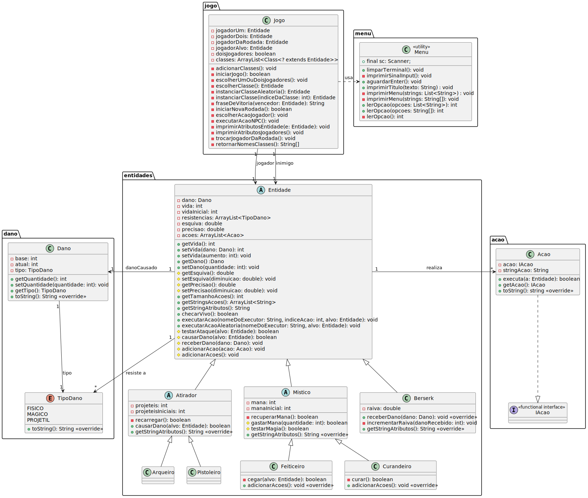

# Sistema de Batalha em Java

## Introdução

Este projeto foi pensado para ser um sistema flexível e genérico para um jogo de batalha 1v1 via seleção de ações por menus (uma mecânica semelhante ao clássico Pokémon, mas sem os gráficos).

Os diretórios dos arquivos foram divididos em pacotes, pensando na modularização, trazendo um dos conceitos mais importantes da orientação a objeto: a **abstração**, uma vez que os pacotes não sabem o que ocorre dentro uns dos outros, somente as informações públicas por eles disponibilizadas.

Abaixo, segue um esquema feito em UML para indicar os diferentes tipos de relação entre as classes criadas para este projeto.



### Explicação da estrutura de arquivos

- `src`  
  Todos os arquivos em src foram divididos no que aprendi serem **packages**, basicamente uma forma de o Java conseguir ter acesso mais fácil a classes que estão em outros lugares do projeto. Cada classe dentro de um package deve declarar a qual package pertence no início do arquivo.

  Nesta pasta, temos os arquivos fonte, basicamente a construção completa do nosso programa.

- `modelagem`  
  Aqui tem um esquema em UML para a descrição visual da relação entre as diferentes classes desse projeto. Além disso, contém uma imagem em `svg` para a visualização no `README.md` da imagem gerada.

## Instalando ferramentas

Para compilar os arquivos, é necessário ter instalado algumas ferramentas da linguagem Java, que estão contidas no pacote `default-jdk`, que pode ser instalado (em sistemas baseados em Debian) com o seguinte comando:

```bash
  sudo apt update
  sudo apt install default-jdk
```

## Compilando

**Observação**: Todos os comandos abaixo devem ser executados no diretório raiz do projeto, cuidado com isso!

```bash
javac -d class src/*.java src/**/*.java # compila tudo de src para o diretorio class
```

## Executando

```bash
java -classpath class Main # roda o sistema
```

## Apagando os arquios binários:

```bash
rm -rf class
```
